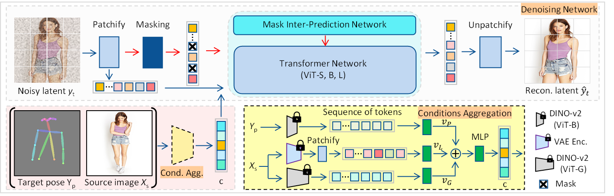
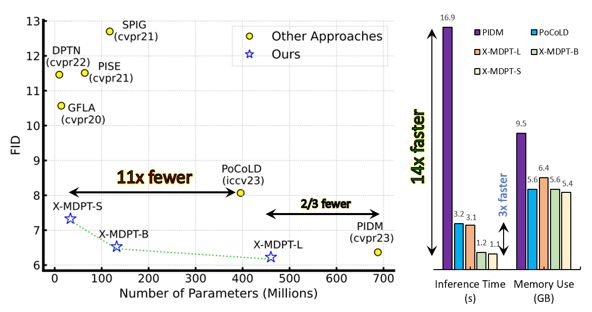
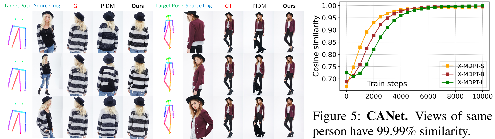

[Updated 2024/08/08]. Code released.

[Planned to release in July 2024]

Pytorch Implementation of [Cross-view Masked Diffusion Transformers for Person Image Synthesis](https://arxiv.org/abs/2402.01516), ICML 2024.

**Authors**: [Trung X. Pham](https://scholar.google.com/citations?user=4DkPIIAAAAAJ&hl=en), [Zhang Kang](https://scholar.google.com/citations?user=nj19btQAAAAJ&hl=en), and Chang D. Yoo.

**Introduction**

X-MDPT ($\underline{Cross}$-view Masked Diffusion Prediction Transformers) is the first diffusion transformer-based framework, a novel approach designed for pose-guided human image generation. X-MDPT demonstrates exceptional scalability and performance, significantly improving FID, SSIM, and LPIPS metrics as model size increases. Despite its straightforward design, the framework outperforms state-of-the-art approaches on the DeepFashion dataset, excelling in training efficiency and inference speed. The compact 33MB model achieves an FID of 7.42, surpassing the prior most efficient Unet latent diffusion approach PoCoLD (FID of 8.07) with $11\times$ fewer parameters (396MB). The best model surpasses SOTA pixel-based diffusion PIDM with two-thirds of the parameters and achieves $5.43\times$ faster inference.

<p align="center">
    
</p>

**Efficiency Advantages**
<p align="center">
    
</p>

**Comparisons with state-of-the-arts**
<p align="center">
    
</p>

**Consistent Targets**
<p align="center">
    
</p>


**Setup Environment**

We have tested with Pytorch 1.12+cuda11.6, using a docker.
```
conda create -n xmdpt python=3.8
conda activate xmdpt
pip install -r requirements.txt
```
**Prepare Dataset**

Downloading the DeepFashion dataset and processing it into the lmdb format for easy training and inference. Refer to [PIDM (CVPR2023)](https://github.com/ankanbhunia/PIDM) for this LMDB.
The data structure should be as follows:
```
datasets/
|-- [  38]  deepfashion
|   |-- [6.4M]  train_pairs.txt
|   |-- [2.1M]  train.lst
|   |-- [817K]  test_pairs.txt
|   |-- [182K]  test.lst
|   |-- [4.0K]  256-256
|   |   |-- [8.0K]  lock.mdb
|   |   `-- [2.4G]  data.mdb
|   |-- [8.7M]  pose.rar
|   `-- [4.0K]  512-512
|       |-- [8.0K]  lock.mdb
|       `-- [8.4G]  data.mdb
|   |-- [4.0K]  pose
|   |   |-- [4.0K]  WOMEN
|   |   |   |-- [ 12K]  Shorts
|   |   |   |   |-- [4.0K]  id_00007890
|   |   |   |   |   |-- [ 900]  04_4_full.txt
|   |   |-- [4.0K]  MEN
...
```

**Training**
```
CUDA_VISIBLE_DEVICES=0 bash run_train.sh
```
**Inference**

_For the test set of Deep Fashion, run the following_
```
CUDA_VISIBLE_DEVICES=0 infer_xmdpt.py
```

_For the arbitrary image, run the following_
```
CUDA_VISIBLE_DEVICES=0 infer_xmdpt.py --image_path test.png
```

**Pretrained Models**

All of our models had been trained and tested using a single A100 (80GB) GPU.

<div align="center">
    
|      **Model**     | **Step** | **Resolution** | **FID** | **Params** | **Inference Time** | **Link** |
|:------------------:|:--------:|:--------------:|:-------:|:----------:|:------------------:|:--------:|
|      X-MDPT-S      |   300k   |     256x256    |   7.42  |    33.5M   |        1.1s        |   [Link](https://drive.google.com/file/d/1loztAzrL6sQI7rarwb_x2233ZwNTVlvD/view?usp=sharing)   |
|      X-MDPT-B      |   300k   |     256x256    |   6.72  |    131.9M  |        1.3s        |   [Link](https://drive.google.com/file/d/1nNPWGhvRZVwjBMfgilbgZNdcn1I1DUgH/view?usp=sharing)   |
|      X-MDPT-L      |   300k   |     256x256    |   6.60  |    460.2M  |        3.1s        |   [Link](https://drive.google.com/file/d/1No_WJBD25HVmYLaKirrI_7k04RpOkNos/view?usp=sharing)   |
|         VAE        |   -   |     -    |   -  |    -  |        -        |      [Link](https://drive.google.com/file/d/1zjoCLuJV-_d-pq7f_N0vZXppUkq8LTP0/view?usp=sharing)    |

</div>

**Citation**
```
@article{pham2024cross,
  title={Cross-view Masked Diffusion Transformers for Person Image Synthesis},
  author={Pham, Trung X and Kang, Zhang and Yoo, Chang D},
  journal={arXiv preprint arXiv:2402.01516},
  year={2024}
}
```
**Acknowledgements**

This work was supported by the Institute for Information & Communications Technology Planning & Evaluation (IITP) grants funded by the Korean government (MSIT) (No. 2021-0-01381, _Development of Causal AI through Video Understanding and Reinforcement Learning, and Its Applications to Real Environments_) and (No. 2022-0-00184, _Development and Study of AI Technologies to Inexpensively Conform to Evolving Policy on Ethics_).

**Helpful Repo**

Thanks nice works of [MDT (ICCV2023)](https://github.com/sail-sg/MDT) and [PIDM (CVPR2023)](https://github.com/ankanbhunia/PIDM) for publishing their codes.
